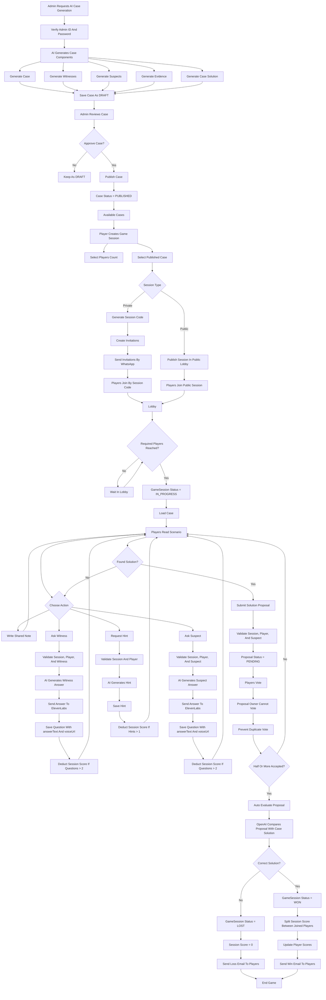
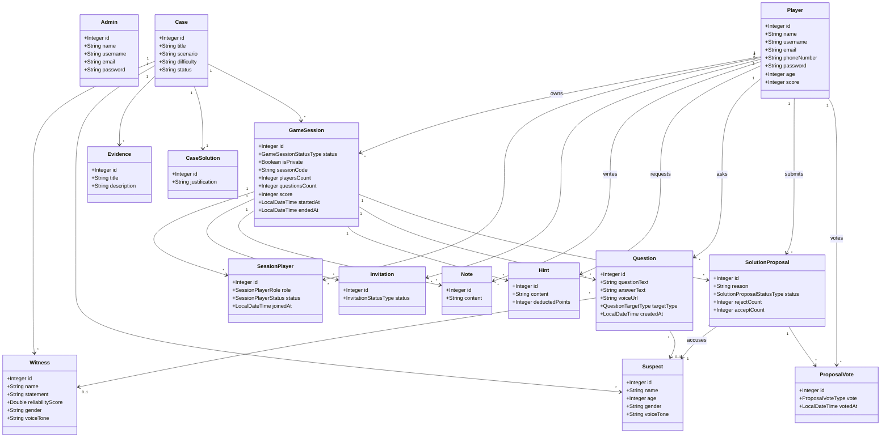

# Red Thread Game

Red Thread Game is a Spring Boot detective mystery game where players work together to solve AI-generated cases. An admin generates and publishes a case, players create or join a game session, investigate witnesses and suspects, request hints, write shared notes, submit a solution proposal, vote as a team, and finally let AI judge whether their accusation is correct.

The game is built around one shared team score. The team starts with a score based on case difficulty, then loses points when they ask too many questions or request extra hints. If the final solution is correct, the remaining session score is divided between the joined players. If the solution is wrong, the session ends as lost and the team gets zero points.

## Tech Stack

- Java
- Spring Boot
- Spring Data JPA
- MySQL
- OpenAI API
- ElevenLabs API
- Twilio WhatsApp API
- Java Mail Sender
- ModelMapper
- Postman

## Main Idea

Players become detectives in a mystery case generated by AI. They read the case scenario, ask witnesses and suspects questions, receive realistic AI-generated answers with voice responses, request hints when stuck, and collaborate through shared notes. When the team thinks they found the culprit, one player submits a solution proposal and the other players vote. Once enough players accept the proposal, OpenAI evaluates the accusation against the real case solution and the game ends with a win or loss.

## AI Usage

- Generate full mystery cases with scenario, witnesses, suspects, evidence, and solution.
- Generate witness answers based on the selected case and witness details.
- Generate suspect answers based on the selected case and suspect details.
- Generate useful hints without revealing the culprit directly.
- Evaluate the final solution proposal against the real solution.
- Analyze player performance and generate a short report.

### Mohammed Al-Rasheed - Gameplay And Interaction

Responsible for what happens inside the session during investigation and solution voting.

#### Question

Base URL: `/api/v1/question`

| Method | Endpoint | Description |
| --- | --- | --- |
| POST | `/ask-witness/{gameSessionId}/{playerId}/{witnessId}` | Ask witness using AI and ElevenLabs |
| POST | `/ask-suspect/{gameSessionId}/{playerId}/{suspectId}` | Ask suspect using AI and ElevenLabs |
| GET | `/count/{gameSessionId}` | Count questions in session |
| GET | `/next-penalty/{gameSessionId}` | Get next question penalty |

#### Hint

Base URL: `/api/v1/hint`

| Method | Endpoint | Description |
| --- | --- | --- |
| GET | `/count/{gameSessionId}` | Count hints in session |
| GET | `/next-penalty/{gameSessionId}` | Get next hint penalty |
| POST | `/request/{gameSessionId}/{playerId}` | Request AI hint |

#### Note

Base URL: `/api/v1/note`

| Method | Endpoint | Description |
| --- | --- | --- |
| POST | `/add/{gameSessionId}/{playerId}` | Add shared note |
| GET | `/latest/{gameSessionId}` | Get latest notes |
| GET | `/search/{gameSessionId}` | Search notes by keyword |

#### Solution Proposal

Base URL: `/api/v1/solution-proposal`

| Method | Endpoint | Description |
| --- | --- | --- |
| POST | `/submit/{gameSessionId}/{playerId}/{suspectId}` | Submit solution proposal |
| GET | `/active/{gameSessionId}` | Get active pending proposal |
| GET | `/result/{gameSessionId}` | Get latest proposal result |

#### Proposal Vote

Base URL: `/api/v1/proposal-vote`

| Method | Endpoint | Description |
| --- | --- | --- |
| POST | `/add/{proposalId}/{playerId}` | Vote ACCEPT or REJECT |

## Game Flow

## Class Diagram

